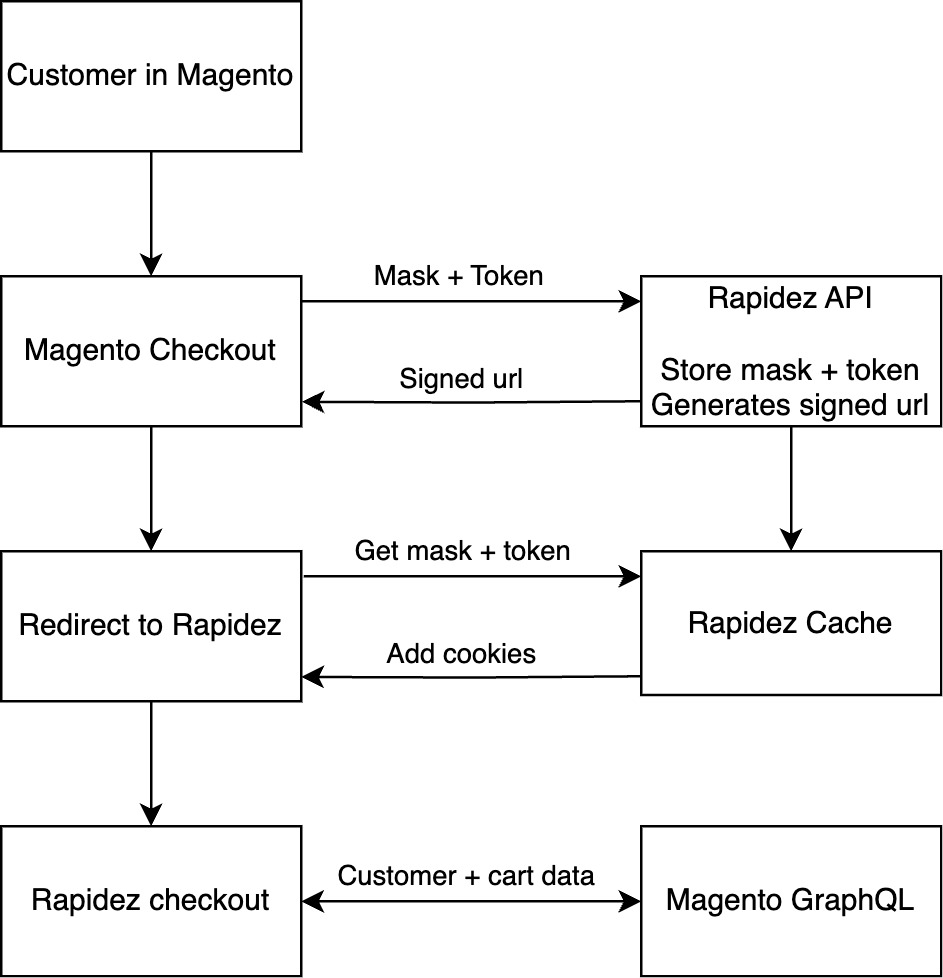

# Magento Rapidez StandaloneCheckout

This Magento module will send users with a valid cart to the Rapidez checkout instead of the Magento checkout so Rapidez can be used as a standalone checkout.

## Installation

### Install the package using composer
 
```bash
composer install rapidez/magento2-standalone-checkout
```

### Enable the module

```bash
bin/magento module:enable Rapidez_StandaloneCheckout
```

## Configuration

All you need to do is set the Rapidez url in the standalone checkout config.
You can do so under `Stores > Configuration > Rapidez > Standalone Checkout > Rapidez Url`

If this is not set the default Magento checkout will still be used.

## Considerations

### Registration

Rapidez' Registration feature will not automatically log you in to Magento

### Rapidez header

By default Rapidez shows a full header and menu on the success page, you might want to consider showing the limited header instead.

## How does it work?

We hook into the checkout controller, if we have a Rapidez url set. 
And have a valid cart mask/hash we will make a call to Rapidez' `api/get-checkout-url` endpoint with the mask.
Rapidez then stores the mask for safekeeping, and returns a redirect url containing the key to get the mask.

Magento will redirect you to this url, then Rapidez can add the mask to your cookies and remove the key from storage.
Once Rapidez has that we can get all info we need using GraphQL.



### Sounds complicated, why?

Because anyone with the cart mask or customer token can impersonate you, so we need to get them across securely.
Magento and Rapidez do not have to run on the same domain so the session can not be shared.
We cannot add the mask to the url parameters of a redirect because any man in the middle would be able to copy the link and be logged in as you.

The link Rapidez generates is valid only once, so even if someone got a hold of it the mask and token are no longer available on that url.
